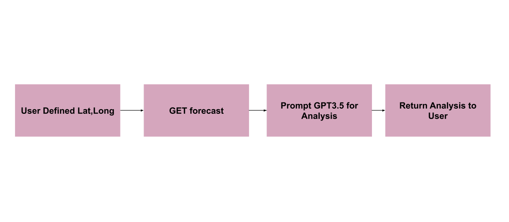
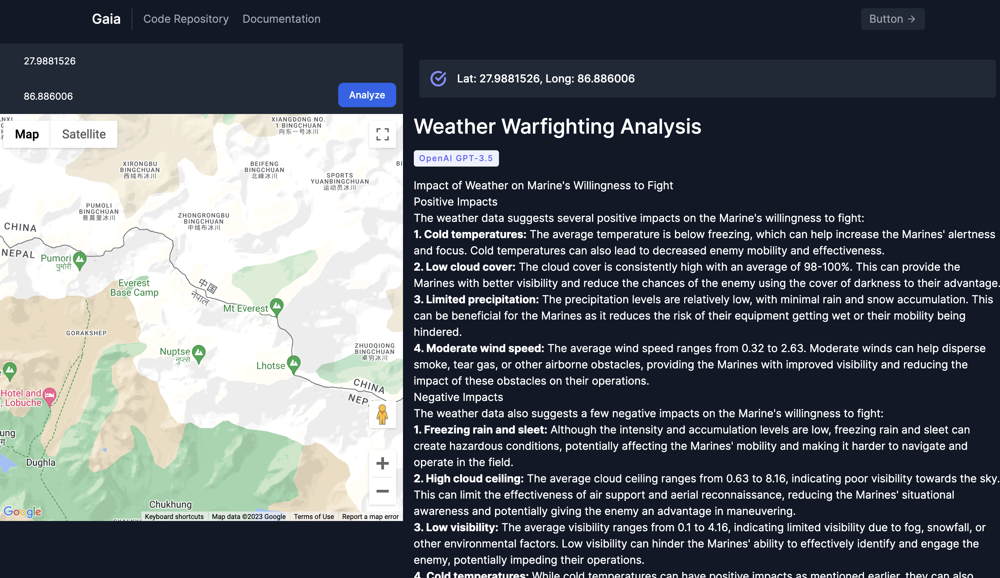

# Gaia
### A warfiging weather planning tool.

This application is designed to intake weather forecast data and produce a report on the implications that weather will have in a battle from the perspective of the Marine Corps MET-T planning doctrine.

This application is being submitted to the Tomorrow.io scholarship hackathon. (https://www.tomorrow.io/weather-api/tomorrow-io-weather-api-scholarship-competition/)

### Example Screenshot:

# To Run:
1. Clone
2. Install dependencies (`npm install`)
3. Create `.env` with API tokens for: 
- TMRW_IO - Tomorrow.io Weather Data API
- OPENAI_API_KEY - OpenAI API Key
- REACT_APP_GOOGLE_MAPS_API_KEY - Google Maps API Key
4. `npm run dev`